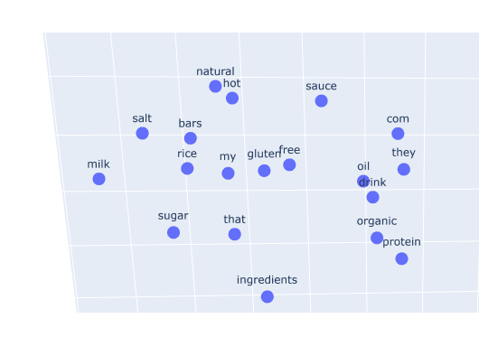
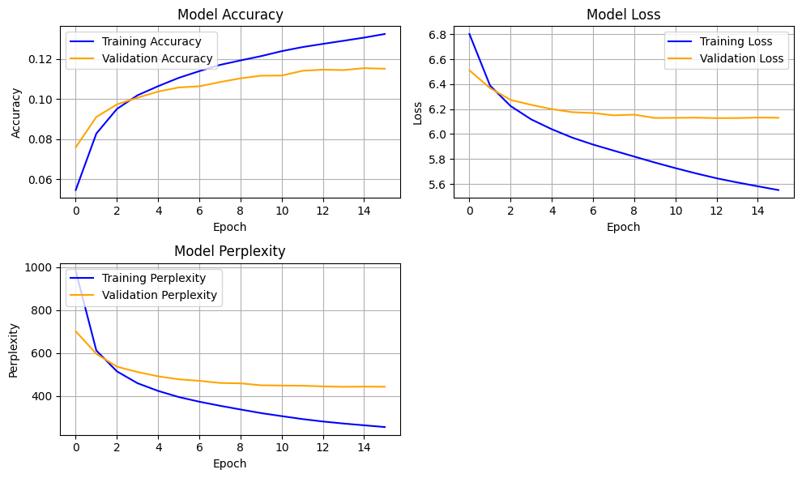
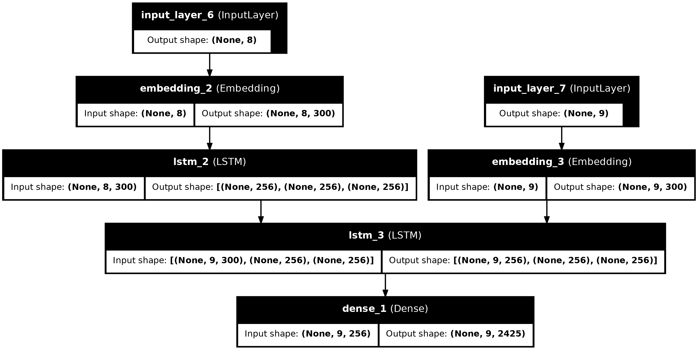
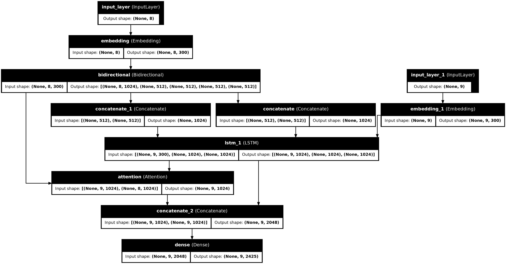

# Desafios - Procesamiento de lenguaje natural

En este repositorio se encuentran las soluciones para los desafios de la materia **Procesamiento de lenguaje natural** de la Especialización en Inteligencia Artificial (CEIA) de la Facultad de Ingeniería de la Universidad de Buenos Aires (FIUBA). 

## Desafío 1: Análisis de Similaridad entre Documentos

En este desafío, se realizó un análisis de similaridad de documentos utilizando el conjunto de datos **20 Newsgroups**. Se aplicaron las siguientes técnicas:

- **Vectorización y análisis de similaridad**: Los documentos fueron vectorizados utilizando **TF-IDF** para representar el contenido textual en un espacio de características numéricas. Posteriormente, se midió la **similaridad de coseno** entre un documento seleccionado y los 5 documentos más similares, buscando analizar si los documentos más similares pertenecen a la misma categoría.

- **Modelos de ML**: Se entrenaron modelos de **Naive Bayes** (Multinomial y ComplementNB) para realizar la tarea de clasificación de documentos. Para maximizar el rendimiento, se utilizó una búsqueda aleatoria de hiperparámetros, optimizando la métrica **f1-score macro** en el conjunto de datos de prueba.

- **Vectorización de palabras**: Se estudió la similaridad entre palabras, seleccionando 5 palabras y analizando las palabras más similares utilizando el mismo enfoque de vectorización.

El notebook con la solución se encuentra en [Desafío 1](desafio_1/solution_notebook.ipynb).

## Desafio 2: Word2Vec y Análisis de Similaridad entre Palabras

En este desafío, se trabajó con una muestra de reseñas de productos del conjunto de datos Fine Food Reviews para entrenar un modelo Word2Vec y analizar la similaridad entre palabras en el contexto de reseñas de productos alimenticios. Se trabajó en los siguiente:

- **Tokenización de Reseñas y Entrenamiento del Modelo Word2Vec**: Se tokenizaron las reseñas y se entrenó un modelo Word2Vec utilizando la librería Gensim.

- **Prueba de analogías**: Se realizaron pruebas de analogías para analizar la similaridad entre palabras en el contexto de reseñas de productos alimenticios y de esa manera, evaluar la calidad del modelo Word2Vec entrenado.

    - "service" fue identificado como similar a la combinación de "customer" y "happy", en contraste con "unhappy".

    - "refund" apareció como el concepto más cercano a la combinación de "support" y "return", lo cual tiene sentido en el contexto de atención al cliente.

    - "pricey" fue identificado como el concepto más cercano a la combinación de "product" y "expensive", en contraste con "cheap".

- **Análisis de Similaridad entre Palabras**: Se analizó la similaridad entre palabras seleccionadas y se identificaron las palabras más cercanas en el espacio vectorial de Word2Vec. Permitiendo capturar relaciones semánticas entre palabras.

- **Visualización de Embeddings**: Se visualizaron los embeddings de las palabras seleccionadas en un espacio de 3 dimensiones, aplicando previamente una [reducción de dimensionalidad con TSNE](desafio_2/utils.py).

    

El notebook con la solución se encuentra en [Desafío 2](desafio_2/solution_notebook.ipynb).

## Desafío 3: Generación de Texto con LSTM basado en Shakespeare

En este desafío, se trabajó con una muestra de las obras de Shakespeare para entrenar un modelo LSTM de generación de texto. Se trabajó en lo siguiente:

- **Carga y Preparación de Datos**: Se cargaron los datos del archivo **shakespeare.txt** y se preprocesaron para segmentar el texto en palabras. Luego, se entrenó un `Tokenizer` para convertir las palabras en índices numéricos. Posteriormente, se dividió el conjunto de datos en entrenamiento y validación, y se aplicó padding para asegurar que todas las secuencias tuvieran la misma longitud.

- **Entrenamiento del Modelo LSTM:** Se definió y entrenó un modelo LSTM secuencial utilizando Keras. El modelo incluye una capa de Embedding con una dimensión de salida de 300, seguida por dos capas Bidirectional LSTM con 128 unidades cada una y capas Dropout para reducir el sobreajuste. Finalmente, se añadió una capa Dense con activación softmax para la clasificación. Se utilizó el optimizador Adam y se implementó EarlyStopping.
    
    
    
(Se puede observar en una gráfica cómo el perplexity del modelo disminuye a medida que avanza el entrenamiento, lo cual indica una mejora en la capacidad del modelo para generar texto coherente).
   

- **Generación de Texto:** Tras el entrenamiento, se generaron nuevas secuencias de texto basadas en una "seed text". El modelo predijo palabras adicionales para completar las frases de manera mejorable pero con cierta coherencia.

El notebook con la solución se encuentra en [Desafío 3](desafio_3/solution_notebook.ipynb).

## Desafío 4: Bot QA 

En este desafío, se trabajó con un conjunto de datos de conversaciones para entrenar un bot de preguntas y respuestas (QA) utilizando una arquitectura encoder-decoder con LSTM y embeddings preentrenados de FastText. Se trabajó en lo siguiente:

- **Carga y Preparación de Datos**: Se cargaron los datos del archivo data_volunteers.json, que contiene diálogos entre un bot y usuarios. Las oraciones de entrada y salida se limpiaron y prepararon añadiendo los tokens `<sos>` y `<eos>` para marcar el comienzo y final de las oraciones. Se descartaron las oraciones que superaban una longitud de 8 palabras.

- **Tokenización y Padding**: Se utilizó el `Tokenizer` de Keras para tokenizar las oraciones de entrada y salida, creando los diccionarios `word2idx_inputs` y `word2idx_outputs`. Luego se aplicó padding para asegurar que todas las secuencias tuvieran la misma longitud. Obteniéndose `encoder_input_sequences`, `decoder_input_sequences` y `decoder_targets`.

- **Preparación de Embeddings**: Se emplearon embeddings preentrenados de `FastText` para inicializar la capa de embeddings del modelo, utilizando la clase [FasttextEmbeddings](desafio_4/words_embeddings.py) para obtener la matriz de embeddings correspondiente.

- **Entrenamiento del Modelo LSTM**: Se probó con el entrenamiento de dos modelos:

    - **Modelo 1**: Se utilizó una arquitectura encoder-decoder sencilla con capas LSTM para el codificador y decodificador. El codificador consistió en una LSTM con 256 unidades, mientras que el decodificador también empleó una LSTM del mismo tamaño. Ambos conectados a una capa Embedding inicializada con los embeddings preentrenados de FastText. Finalmente, se añadió una capa densa con activación softmax para la predicción de las siguientes palabras en la secuencia.

        

    - **Modelo 2**: Se utilizó una arquitectura encoder-decoder mejorada que incluía una capa Bidirectional LSTM con 512 unidades en el codificador y un mecanismo de Attention. Los estados hacia adelante y hacia atrás se concatenaron y se pasaron al decodificador, que utilizó una LSTM con 1024 unidades. Además, se aplicó el mecanismo de atención para mejorar el enfoque en las partes más relevantes de la secuencia de entrada. Finalmente, se añadió una capa densa con activación softmax y regularización L2. 

        

- **Generación de Respuestas**: El modelo mostró la capacidad de generar respuestas coherentes y relacionadas con las preguntas de entrada. Algunos ejemplos destacados fueron:

    - **Pregunta**: "where are you from"
    - **Respuesta**: i am from the us (modelo 1)

    - **Pregunta**: "Do you read?"
    - **Respuesta**: i do not like to read (modelo 2)

    - **Pregunta**: "Hello, do you play any sports?"
    - **Respuesta**: i do not like to (modelo 2)

    Las respuestas son destacables debido a lo limitado del conjunto de datos y la relativa simplicidad de los modelos.

El notebook con la solución se encuentra en [Desafío 4](desafio_4/solution_notebook.ipynb).

## Desafío 5: Clasificación de Sentimientos con BERT

En este desafío, se trabajó en la clasificación de críticas de Google Apps para predecir el sentimiento utilizando un modelo basado en BERT. Se trabajó en lo siguiente:

- **Tokenización y División de Datos**: Después de limpiar y balancear el dataset, se tokenizaron las críticas utilizando el tokenizador de BERT y se dividió el dataset en conjuntos de entrenamiento, validación y test.

- **Entrenamiento del Modelo BERT (pesos congelados)**: Se utilizó un modelo BERT preentrenado con pesos congelados, añadiendo varias capas densas con Batch Normalization y activación ReLU para la clasificación de sentimientos. Se aplicó dropout y regularización L2 para evitar el sobreajuste.

- **Entrenamiento del Modelo BERT (fine-tuning)**: Se realizó un fine-tuning del modelo BERT, permitiendo que todas las capas fueran entrenables y añadiendo capas densas con regularización L2 y dropout para mejorar la generalización. Se redujo el número de épocas para prevenir el sobreajuste.

- **Resultados**: Aunque ambos modelos no lograron alcanzar métricas destacables, demostraron la capacidad de BERT para clasificar las críticas con un rendimiento aceptable. Con un dataset más grande y más diverso, es probable que se puedan obtener mejores resultados. 

    Algunos ejemplos de predicciones del modelo fine-tuning fueron:

    - **Crítica**: "I love this app"
    - **Sentimiento Predicho**: Positive

    - **Crítica**: "I hate this product, it is terrible!"
    - **Sentimiento Predicho**: Negative

    - **Crítica**: ""The app is okay, nothing special."
    - **Sentimiento Predicho**: Neutral

El notebook con la solución se encuentra en [Desafío 5](desafio_5/solution_notebook.ipynb).